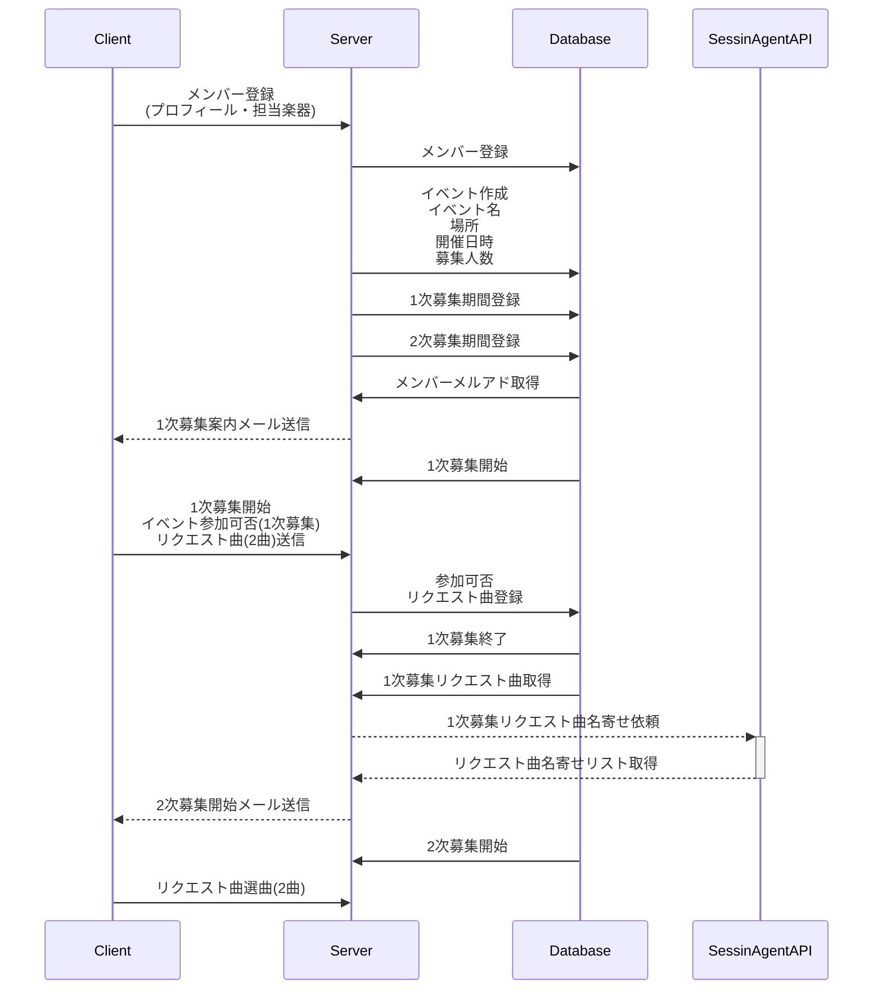

# セッションイベント作成シーケンス

```mermaid
sequenceDiagram
    participant Client
    participant Server
    participant Database
    participant SessinAgentAPI

    Client->>Server: メンバー登録<br>(プロフィール・担当楽器)
    Server->>Database: メンバー登録
    Server->>Database: イベント作成<br>イベント名<br>場所<br>開催日時<br>募集人数
    Server->>Database: 1次募集期間登録
    Server->>Database: 2次募集期間登録
    Database->>Server: メンバーメルアド取得
    Server-->>Client: 1次募集案内メール送信
    Database->>Server: 1次募集開始
    Client->>Server: 1次募集開始<br>イベント参加可否(1次募集)<br>リクエスト曲(2曲)送信
    Server->>Database: 参加可否<br>リクエスト曲登録
    Database->>Server: 1次募集終了
    Database->>Server: 1次募集リクエスト曲取得
    Server-->>+SessinAgentAPI: 1次募集リクエスト曲名寄せ依頼
    SessinAgentAPI-->>-Server: リクエスト曲名寄せリスト取得
    Server-->>Client: 2次募集開始メール送信
    Database->>Server: 2次募集開始
    Client->>Server: リクエスト曲選曲(2曲)
```